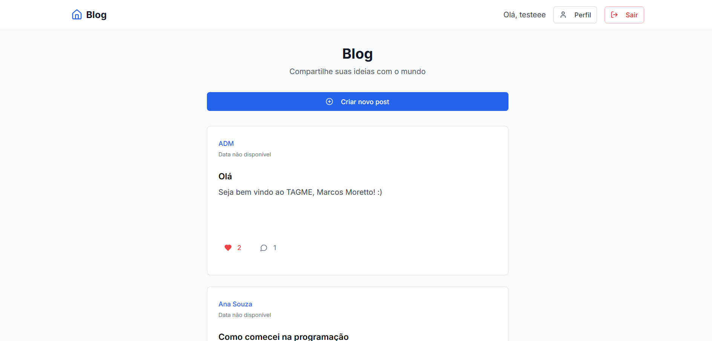
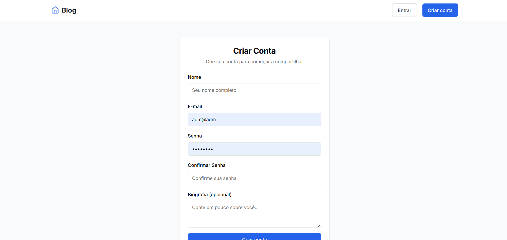
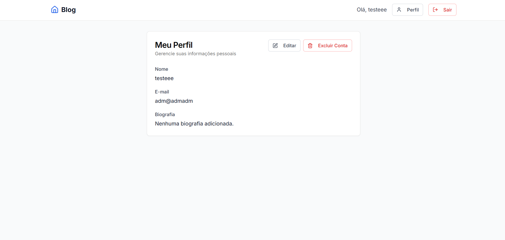

# 📝 Blog Fullstack



---

## 🚀 Sobre o Projeto

Este é um blog fullstack com frontend em **Next.js** e backend em **Node.js (Express)**. O banco de dados usado é **MySQL**.

---

## 📦 Instalação

1.  **Clone o repositório:**

    ```bash
    git clone [https://github.com/seu-usuario/blog.git](https://github.com/VitorGirottto/blog.git)
    cd blog
    ```

2.  **Instale as dependências:**

    ```bash
    npm install
    cd backend
    npm install
    ```

---

## 🛠️ Banco de Dados

1.  **Crie a base `blog` no MySQL:**

    ```sql
    CREATE DATABASE blog;
    ```

2.  **Importe o arquivo `blog.sql` (na raiz do projeto) e execute em seu banco de dados:**


3.  **Configure o acesso em `backend/config/database.js` (ou use um arquivo `.env`):**

    ```env
    DB_NAME=blog
    DB_USER=root
    DB_PASSWORD=suasenha
    DB_HOST=localhost
    ```

---

## ▶️ Rodando o Projeto

1.  **Inicie o backend (porta 5000):**

    ```bash
    cd backend
    npm run dev
    ```

2.  **Em outro terminal, inicie o frontend (porta 3000):**

    ```bash
    npm run dev
    ```

---

## 🧪 Tecnologias

* Next.js
* React
* Node.js + Express
* Sequelize + MySQL
* Tailwind CSS

---

## 📸 Prints



